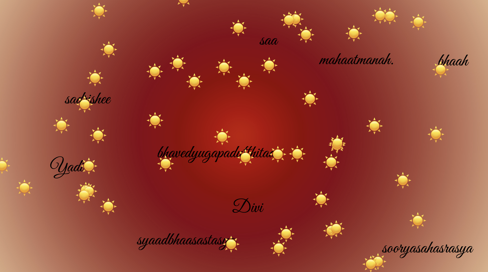

For this week's assignment, I want to use the word I saw in Oppenheimer, Divi sooryasahasrasya bhavedyugapadutthitaa; Yadi bhaah sadrishee saa syaadbhaasastasya mahaatmanah.
This quote is from the Bhagavad Gita, Chapter 11, Verse 12. he referenced this verse after the successful test of the first atomic bomb in the United States in 1945.
This Sanskrit verse can be translated as:
"If the radiance of a thousand suns were to burst at once into the sky, that would be like the splendor of the mighty one."

I want to use this word to monitor the explotion scene, click the bomb emoji the screen will change, and hence the sentence will scatter, click the word will have sun emoji appear in the screen.
